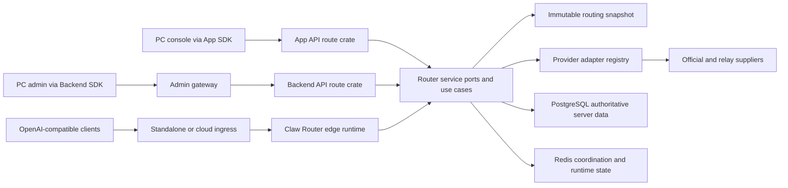

# SDKWork Claw Router Technical Architecture

Status: active  
Owner: SDKWork maintainers  
Application: sdkwork-clawrouter  
Updated: 2026-07-31
Specs: `ARCHITECTURE_SPEC.md`, `API_SPEC.md`, `SDK_SPEC.md`, `DATABASE_SPEC.md`, `SECURITY_SPEC.md`, `DEPLOYMENT_SPEC.md`

## 1. Architecture Overview

Claw Router separates HTTP surfaces, application use cases, routing policy,
provider transport, persistence, and generated SDKs. The core upstream domain
uses exactly three product aggregates: `UpstreamSupplier`, `UpstreamAccount`,
and `UpstreamAccountGroup`.



The route planner sees domain values and ports, not Axum, SQLx, or provider SDK
types. Provider-specific behavior is selected by `adapter_code` and registered
behind adapter traits. New suppliers and adapters extend registries and
contracts without adding conditionals to the core selector.

## 2. Technology Choices

| Concern | Choice | Boundary |
| --- | --- | --- |
| Backend language | Rust | Domain, routing, adapters, gateways, workers |
| HTTP | Axum through SDKWork web-framework boundaries | Thin route composition and typed request context |
| Authoritative persistence | PostgreSQL through SQLx | All server systems of record and server tests |
| Client-local persistence | SQLite only in an explicitly declared client-local module | Never a router-service fallback or server schema mirror |
| Distributed coordination | Redis where the feature contract requires it | Circuit, idempotency, quota, sticky or cluster coordination |
| Frontend | React and Vite workspace packages | UI calls package-owned service boundaries |
| API contracts | Authored route/field contracts materialized to OpenAPI | Source of generated SDK families |
| SDKs | Claw Router app/backend/open SDKs plus declared dependency SDKs such as `@sdkwork/payment-backend-sdk` | No raw business HTTP, manual auth headers, dependency API copies, or generated transport edits in consumers |
| Upstream transport | HTTPS provider adapters with bounded request/response behavior | Credentials are attached only after target validation |

PostgreSQL is the sole authoritative server engine in standalone, split-service,
container, and cloud deployments. Server startup rejects SQLite before database
initialization. SQLite is allowed only for a separately owned client-local
contract such as device-scoped cache or offline state; none is implemented by
the router-service SQL infrastructure.

## 3. System Boundaries And Modules

### API And Ingress

- `crates/sdkwork-routes-clawrouter-app-api` composes authenticated product APIs.
- `crates/sdkwork-routes-clawrouter-backend-api` composes management APIs.
- `services/sdkwork-clawrouter-standalone-gateway` is the standalone listener.
- `services/sdkwork-clawrouter-admin-gateway` is the management listener.
- `crates/sdkwork-clawrouter-edge-runtime` assembles invocation/runtime behavior.
- `crates/sdkwork-api-clawrouter-assembly` and
  `crates/sdkwork-api-clawrouter-standalone-gateway` own standard API assembly
  and application ingress composition.

Route modules decode and validate HTTP input, resolve typed request context,
invoke ports/use cases, and map results to standard envelopes or RFC 9457
Problem Details. They do not own SQL or provider calls.

### Domain And Application

- `services/sdkwork-clawrouter-router-service/src/domain` owns domain values and
  invariants.
- `application/upstream_route_selector.rs` owns candidate filtering and
  selection.
- `application/upstream_account_route_planner.rs` owns route-plan composition.
- `ports/upstream_account_route_catalog.rs` exposes immutable route candidates
  through `Arc<[UpstreamAccountRoute]>`.
- Invocation application modules coordinate entitlement, routing, dispatch,
  telemetry, and accounting ports.
- `api/app_chat.rs`, `ports/app_chat_store.rs`, and
  `infrastructure/sql/postgres/app_chat_store.rs` own the currently implemented
  first-party Chat HTTP adaptation, persistence port, and PostgreSQL adapter.

The refreshable SQL catalog publishes `ArcSwap<SqlPricingCatalogSnapshot>`.
Each request borrows an immutable `Arc` snapshot; refresh performs a pointer
swap, and in-flight requests retain the old snapshot safely. The hot path does
not deep-clone every route or hold a lock across `.await`.

### Provider Adapters

- `sdkwork-claw-provider-adapter-contract` defines the adapter contract.
- `sdkwork-claw-provider-adapter-registry` resolves adapter implementations.
- `sdkwork-claw-provider-adapter-http` owns HTTP transport behavior.
- `crates/provider-adapters/*` and service adapters implement supplier-specific
  protocol translation.

The core domain depends on adapter ports. Adding an adapter does not create a
new supplier table, credential store, route DTO family, or frontend HTTP path.

### Composed Payment Administration

The `sdkwork-payment` repository owns the Payment backend OpenAPI authority,
the generated/composed `@sdkwork/payment-backend-sdk`, the
`@sdkwork/payment-pc-admin-provider` package, provider-account credentials,
methods, channels, route rules, payment runtime records, webhook events, and
reconciliation. Claw Router consumes those public boundaries; it does not copy
Payment DTOs, generated transport, controllers, credential forms, or auth
headers.

The Claw Router admin-payments package owns host composition and one
product-specific extension: provider inventory exposed through
`@sdkwork/clawrouter-backend-sdk`. The current UI route for Payment channels is
`/admin/payments/channels`. `/admin/channel` is retired and is neither a route
nor an ownership authority.

### Persistence

`services/sdkwork-clawrouter-router-service/src/infrastructure/sql/postgres`
contains remaining PostgreSQL adapters while capability-owned stores migrate to
`sdkwork-clawrouter-<capability>-repository-sqlx` crates. The migration inventory
is `specs/database-store-migration.manifest.json`.

The database authority chain is:

1. `database/contract/schema.yaml` and module contracts.
2. `database/ddl/baseline/postgres/0001_clawrouter_baseline.sql`.
3. `generated/schema/postgres/schema.sql` and table registry artifacts.
4. PostgreSQL repository, transaction, migration, and drift verification.

There is no server SQLite baseline, generated server SQLite schema, or
router-service SQLite adapter directory.

### Chat Persistence

Claw Router is the current system of record for the first-party Chat surface.
The authored fragment `docs/schema-registry/tables/ai-chat-runtime.yaml`
declares six transcript/context tables plus `ai_runtime_invocation` and
`ai_runtime_usage_link`. All eight are PostgreSQL-only server authorities and
bind numeric `tenant_id`, `organization_id`, and `user_id` scope.

One turn creation transaction locks its conversation row with `FOR UPDATE`,
allocates turn/item/message ordinals from the locked aggregate counters, writes
the input and pending output timeline, and advances the counters. Completion
locks the same aggregate, reconciles the output message and optional usage link,
uses an atomic counter for context snapshots, and updates the conversation.
Scoped unique indexes remain the final collision guard. Counter underflow and
`BIGINT` exhaustion fail closed. Conversation previews are bounded to the
schema's 1024-character limit before persistence.

List reads apply subject predicates and SQL `LIMIT`/`OFFSET`; the HTTP boundary
rejects non-canonical aliases and page sizes outside `1..=200`. Cursor/keyset
pagination and production-like query-plan evidence for high-volume message
history remain release gates under `PAGINATION_SPEC.md`; bounded offset behavior
must not be described as proof of large-history scalability.

Readiness checks the materialized table inventory, lifecycle installation
state, critical Chat columns and scoped indexes, database connectivity, and the
runtime ID lease. A failed contract parse, missing schema fact, database error,
or unhealthy ID lease reports not ready.

`ai_runtime_usage_link` links Chat records to runtime and usage facts but is not
the billing ledger; `ai_usage` remains the billing source of truth. Runtime
events, runtime artifacts, agent state, and memory state are outside the current
eight-table implementation. Data ownership and future transfer requirements are
recorded in
[ADR-20260730](../decisions/ADR-20260730-own-chat-runtime-postgres-authority.md).

## 4. Upstream Supplier Data Model

The canonical aggregate tables are:

| Table | Responsibility |
| --- | --- |
| `ai_upstream_supplier` | Supplier identity, type, adapter, protocol, and lifecycle |
| `ai_upstream_supplier_endpoint` | Supplier Base URLs, priority, weight, region, and timeout |
| `ai_upstream_supplier_auth_method` | Supported non-secret authentication method configuration |
| `ai_upstream_supplier_resource` | Supplier resource/resource-group allowlist |
| `ai_upstream_account` | One billable account at one supplier |
| `ai_upstream_account_credential` | Versioned encrypted credential authority |
| `ai_upstream_account_group` | Routing, fallback, cost, sale, and capacity policy |
| `ai_upstream_account_group_member` | Account membership, priority, weight, and cost override |
| `ai_upstream_account_group_resource` | Group resource/resource-group allowlist |

Operational state is separated from configuration:

| Table | Responsibility |
| --- | --- |
| `ai_upstream_account_health_state` | Current account health and error/latency state |
| `ai_upstream_supplier_endpoint_health_state` | Current endpoint health and error/latency state |
| `ai_upstream_account_group_metric_snapshot` | Rebuildable group-level operational metrics |

`ai_resource` and `ai_resource_group` remain catalog authorities. A supplier
declares what it can serve; a group declares what it may route; API-key/tenant
entitlements declare what the caller may use. Effective resources are the
intersection of those sets.

The retired upstream aggregates are not valid production authorities:
`ai_provider`, `ai_site*`, `ai_channel*`, `ai_upstream_pool`,
`integration_provider_account`, and `integration_service_provider*`.

## 5. Invocation And Routing Lifecycle

1. Authenticate the request and resolve tenant, organization, API key, and
   permissions from typed request context.
2. Normalize the API operation, model/resource, capability, region, streaming,
   and idempotency/sticky identity.
3. Resolve ordered account groups from routing policy and API-key entitlement.
4. Load one immutable route snapshot and intersect supplier, group, and caller
   resources.
5. Reject candidates by tenant scope, lifecycle, effective interval, protocol,
   auth compatibility, credential status, quota, health, and circuit state.
6. Apply the account-group strategy to eligible members. Routing weight affects
   traffic distribution only; financial multipliers do not.
7. Rank compatible endpoints by preferred endpoint, priority, region, health,
   and weight, then resolve one active credential version.
8. Validate the egress target, reserve bounded capacity, and dispatch through
   the selected adapter. Retry only when policy and request idempotency allow it.
9. Record redacted routing decision, usage, health feedback, procurement cost,
   customer charge, audit, and settlement facts.

No fallback crosses tenant/organization boundaries. No credential may be used
for another account, auth method, or endpoint target. Candidate snapshots,
errors, logs, and traces exclude raw credential material.

Accounting payload capacity is enforced at each ownership boundary. Usage
commands reject a `pricing_snapshot` larger than 16 KiB before JSON parsing;
durable retry adapters reject an encoded envelope larger than 32 KiB before
decoding and retain only bounded byte-count/SHA-256 evidence for oversized
poison records. PostgreSQL settlement claims at most 200 rows and projects `{}`
instead of transferring an oversized historical snapshot, then marks that fact
`INVALID_PRICING_SNAPSHOT` in the same transaction. These deterministic limits
bound one settlement claim's pricing-snapshot text to 3.2 MiB before ordinary
row and allocator overhead. Queue-wide memory, storage, retention, and overload
budgets remain deployment/SRE gates and are not inferred from per-record limits.
The desktop-only in-memory adapter additionally rejects a 1025th queued entry;
all non-desktop deployments require Redis at startup and never fall back to an
in-memory or SQLite accounting queue.

## 6. API, SDK, And Data Ownership

Management resources use plural REST paths beneath `/backend/v3/api/ai`,
including `/upstream_suppliers`, `/upstream_accounts`, and
`/upstream_account_groups`. HTTP query names use snake_case, including `page`
and `page_size`; generated TypeScript parameters use camelCase such as
`pageSize`. List payloads use bounded store-level pagination and standard page
metadata.

The contract chain is:

```text
docs/schema-registry/frontend-field-contracts.yaml
  -> generated/api/api-contract-manifest.json
  -> generated/openapi/clawrouter-*-openapi.json
  -> generated @sdkwork/clawrouter-*-sdk packages
  -> PC package service boundaries
```

Generated SDK output is never hand-edited. Management UI calls
`@sdkwork/clawrouter-backend-sdk`; product UI calls
`@sdkwork/clawrouter-app-sdk`; public gateway consumers use
`@sdkwork/clawrouter-open-sdk`. Missing methods or incorrect DTOs are fixed at
the contract or implementation authority and regenerated.

Payment is an explicit dependency exception to the Claw-only list above:
Payment-owned management operations use `@sdkwork/payment-backend-sdk` through
the injected `@sdkwork/payment-service` boundary. The provider-account UI and
controller come from `@sdkwork/payment-pc-admin-provider`. Only the
Claw-specific provider inventory list uses the Claw backend SDK. This
owner/dependency split is declared in both component specs and SDK manifests.

### Frontend Pagination Sessions

Interactive Payment tables request one bounded server page at a time. TypeScript
uses generated SDK fields `page` and `pageSize`; generated transport serializes
the HTTP query as `page` and `page_size`, and the UI renders server `pageInfo`.
No list-all helper or client-side array slicing implements pagination.

Payment controller lists use `createSdkWorkPagedListSession`. A monotonically
increasing request version prevents an older list response from replacing a
newer query result. Concurrent `loadMore` calls share one in-flight promise, so
one continuation page is fetched and appended once. Reset and explicit item
replacement invalidate outstanding responses. These are client consistency
semantics only; they do not replace store-level SQL/keyset pagination,
authorization, cancellation, or backend capacity limits required by
`PAGINATION_SPEC.md`.

### Admin Analytics Read Model

`GET /backend/v3/api/system/analytics/admin/overview` is owned by the backend
surface and consumed through
`system.analytics.admin.overview.retrieve(...)`. The route validates a strict
UTC window before entering the repository. Defaults and explicit maximums are
bounded by bucket type: hourly defaults to 24 hours and permits 30 hours;
daily defaults to 30 days and permits 31 days; weekly defaults to 84 days and
permits 210 days; monthly defaults to 366 days and permits 731 days; yearly
defaults to and permits 3653 days.

The PostgreSQL adapter runs every aggregate for one response inside a
`REPEATABLE READ`, `READ ONLY` transaction. Trend SQL orders buckets descending
to select the latest 30 and then returns them ascending. Bucket formatting is
UTC. Ranking limits are validated as `3..=50` and applied in SQL using numeric
aggregate sort keys. The union of the three bounded user rankings contains at
most 150 user identifiers; per-user model distribution SQL uses that set with
`ANY($5::text[])` and retains five rows plus an `Others` aggregate per user.
These bounds prevent a tenant-wide distribution result from being accumulated
in process memory.

Repository arithmetic uses the fixed-scale `DecimalValue` contract and checked
integer operations. Counts and monetary/token decimals serialize as JSON
strings; percentage display values use integer half-up rounding. PostgreSQL
decode failures, negative aggregates, inconsistent failed-request counts, and
overflow fail the request instead of substituting zero. The PC service layer
rejects numeric JSON for these string fields and retains exact values until a
bounded chart projection is required.

## 7. Security, Privacy, And Observability

### Credentials

- Currently implemented upstream auth policies are `api_key`,
  `bearer_token`, and `custom`.
- OAuth is an extension point, not a declared working capability.
- Credential create/rotate inputs are write-only. Read responses expose masked
  metadata only and never return the submitted secret.
- Stored credential material uses AES-256-GCM with authenticated context,
  HKDF-derived keys, key identifiers, fingerprinting, and keyring-based
  rotation.
- Secret values are excluded from audit records, route explanations, provider
  errors, traces, and generated read DTOs.
- Payment provider-account and certificate inputs are also write-only. Claw
  Router never rehydrates them into browser state; the Payment service encrypts
  replacements before PostgreSQL persistence. Read DTOs expose only presence,
  storage mode, masked metadata, and lifecycle state.

### Payment RBAC

The admin shell permission `clawrouter.admin.access` controls visibility of the
`/admin/payments/**` host route. It does not grant Payment mutations. The
Payment IAM manifest and backend OpenAPI operation metadata own exact action
permissions, and the Claw host passes the same effective permission scope into
the provider UI capability map:

| Action | Required permission |
| --- | --- |
| Create provider account | `commerce.payments.provider_accounts.create` |
| Update provider account | `commerce.payments.provider_accounts.update` |
| Test provider credentials | `commerce.payments.provider_accounts.test` |
| Rotate provider credentials | `commerce.payments.provider_accounts.credentials.rotate` |
| Create sub-merchant | `commerce.payments.sub_merchants.create` |
| Update sub-merchant | `commerce.payments.sub_merchants.update` |
| Delete sub-merchant | `commerce.payments.sub_merchants.delete` |

Frontend capability checks remove or disable unavailable actions, but the
Payment backend remains the authorization boundary. Production approval of the
effective role assignments and denial behavior requires security review and
negative authorization evidence.

### Egress And Runtime Safety

- Provider transport is HTTPS-only for production upstream dispatch.
- Targets are validated before credentials are attached; DNS/IP policy rejects
  forbidden local/private destinations according to the security boundary.
- Request and response bodies, retry batches, query pages, and worker batches
  require explicit bounds. Streaming paths must apply backpressure and terminal
  cleanup rather than buffering complete responses.
- Database pools, timeouts, and transaction isolation are explicit. Financial
  and idempotent writes use PostgreSQL transaction and locking semantics.

### Runtime Identifiers

- Server and container processes bootstrap one shared `SnowflakeIdGenerator`
  through `sdkwork-database-id` after the PostgreSQL lifecycle is ready and
  before seed or runtime writes.
- `sdkwork_node_registry` allocates node IDs with expiring heartbeats, random
  ownership tokens, monotonic lease versions, and database-time comparisons.
  Active leases are never reclaimed from matching human-readable identity.
- Lease ownership loss or expiry fences the generator. Runtime writes fail
  closed, readiness reports unavailable, and a bounded-backoff worker obtains
  and atomically installs a new process lease.
- Prometheus exports `clawrouter_runtime_id_generator_ready` and
  `clawrouter_runtime_id_failures_total{operation,reason}`. Failure labels are
  fixed operational codes for bootstrap, recovery, state, lease, clock,
  sequence, contention, and capacity conditions; raw error text and process
  identity never enter metric labels.
- Kubernetes injects Pod name and UID for diagnostics. Static
  `SDKWORK_CLAW_SNOWFLAKE_NODE_ID` values are rejected outside single-process
  desktop development and are never a cluster identity authority.
- The current platform allocator still runs idempotent registry DDL from its
  allocation path. PostgreSQL requires schema `CREATE` even for `CREATE TABLE
  IF NOT EXISTS` when the table already exists, which conflicts with the
  `DATABASE_SPEC` least-privilege runtime role. Production approval remains
  blocked until `sdkwork-database` provides migrator-owned registry
  provisioning and a runtime verify/allocate path that needs only table DML.

### Observability

Structured logs and traces use request/trace identity and bounded labels.
Routing decisions record candidate counts and rejection reasons without
credentials or unbounded provider payloads. Health writers update the dedicated
account and endpoint health-state tables. Usage, audit, and ledger facts are
durable authorities; dashboards and metric snapshots are rebuildable read
models.

Every served process uses the shared `sdkwork-web-framework`
`HttpMetricsRegistry`. App/backend framework requests record route templates,
operation IDs, surface, method, numeric status, and handler latency; open and
internal routes that do not enter the framework pipeline are recorded by the
Claw HTTP router layer. The registry has an exact 4096 request-series ceiling,
64 fixed contention shards, a 2048-byte label-key bound, and an independent
128-stage ceiling. Request and pipeline durations use the documented
`0.005` through `30` second Prometheus histogram buckets. Saturation increments
`sdkwork_http_metric_series_dropped_total` without growing memory or rejecting
business traffic.

`GET /metrics` combines the canonical framework exposition with native
readiness, tenant-isolation, runtime-ID, and invocation metrics registered in
the process. There is no independent metrics listener or in-process SLO sample
collector. Availability, throughput, and latency percentiles are derived in
PromQL from `sdkwork_http_requests_labeled_total` and
`sdkwork_http_request_duration_seconds_bucket`. Kubernetes pods declare scrape
annotations for their actual listener ports; the checked-in dashboard and
alerts use only runtime-exposed or Kubernetes/cAdvisor metrics and bounded
deployment labels. Operational response is documented in
[the observability alert runbook](../../runbooks/observability-alert-response.md).

The checked-in 1-second p95 and 2-second p99 control-plane alerts are incident
guardrails, not accepted customer SLA values. Final latency, throughput, and
memory ceilings remain blocked on the reproducible release-candidate load and
soak evidence required by the PRD.

## 8. Deployment And Runtime Topology

| Profile | Server database | Coordination | Shape |
| --- | --- | --- | --- |
| `standalone` development | PostgreSQL | Redis optional only where feature policy permits | Unified local process or standard standalone gateway |
| `standalone` production | PostgreSQL | External Redis where enabled features require it | Unified or split application services |
| `cloud` | Managed/operated PostgreSQL | Managed/operated Redis | Split services behind dedicated ingress |
| Explicit client-local feature | Separate SQLite client-local contract | No server authority | Device/profile scoped only |

Readiness verifies database connectivity, required schema, and the runtime ID
lease before serving traffic. Production and commercial claims additionally require clean-install,
upgrade, backup/restore, failover, multi-replica, load, soak, memory, and fault
injection evidence from the release candidate.

## 9. Architecture Decision Index

- [ADR-20260728: Standardize upstream supplier routing](../decisions/ADR-20260728-standardize-upstream-supplier-routing.md)
- [ADR-20260730: Own Chat runtime PostgreSQL authority](../decisions/ADR-20260730-own-chat-runtime-postgres-authority.md)
- [ADR-20260720: Dedicated cloud ingress](../decisions/ADR-20260720-dedicated-cloud-ingress.md)
- [ADR-20260710: Commercial gateway safety boundaries](../decisions/ADR-20260710-commercial-gateway-safety-boundaries.md)

Older documents that describe provider/site/channel or dual server database
models are superseded and must not be used as current architecture authority.

## 10. Verification

The narrowest changed-surface checks run first. Cross-boundary changes also
run:

```text
cargo fmt --all -- --check
cargo check -p sdkwork-routes-clawrouter-app-api
cargo check -p sdkwork-routes-clawrouter-backend-api
cargo check -p sdkwork-clawrouter-edge-runtime
python -B -m tools.rust_backend_architecture_guardian
python -B -m tools.schema_quality_gate
python -B -m tools.clawrouter_sdk_guardian
python -B -m tools.sdkwork_standard_alignment_guardian --strict
node ../sdkwork-specs/tools/check-component-port-bindings.mjs --root .
node ../sdkwork-specs/tools/check-permission-composition.mjs --root .
node ../sdkwork-specs/tools/check-pagination.mjs --workspace .
```

Passing static checks is necessary but not sufficient for launch. The active
commercial-readiness requirement owns production evidence and approval.
