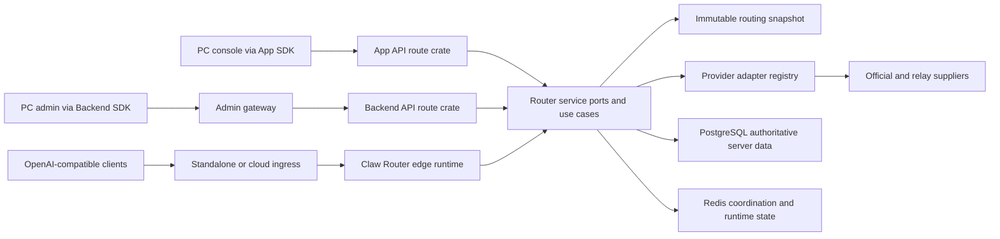

# SDKWork Claw Router Technical Architecture

Status: active  
Owner: SDKWork maintainers  
Application: sdkwork-clawrouter  
Updated: 2026-07-29  
Specs: `ARCHITECTURE_SPEC.md`, `API_SPEC.md`, `SDK_SPEC.md`, `DATABASE_SPEC.md`, `SECURITY_SPEC.md`, `DEPLOYMENT_SPEC.md`

## 1. Architecture Overview

Claw Router separates HTTP surfaces, application use cases, routing policy,
provider transport, persistence, and generated SDKs. The core upstream domain
uses exactly three product aggregates: `UpstreamSupplier`, `UpstreamAccount`,
and `UpstreamAccountGroup`.



The route planner sees domain values and ports, not Axum, SQLx, or provider SDK
types. Provider-specific behavior is selected by `adapter_code` and registered
behind adapter traits. New suppliers and adapters extend registries and
contracts without adding conditionals to the core selector.

## 2. Technology Choices

| Concern | Choice | Boundary |
| --- | --- | --- |
| Backend language | Rust | Domain, routing, adapters, gateways, workers |
| HTTP | Axum through SDKWork web-framework boundaries | Thin route composition and typed request context |
| Authoritative persistence | PostgreSQL through SQLx | All server systems of record and server tests |
| Client-local persistence | SQLite only in an explicitly declared client-local module | Never a router-service fallback or server schema mirror |
| Distributed coordination | Redis where the feature contract requires it | Circuit, idempotency, quota, sticky or cluster coordination |
| Frontend | React and Vite workspace packages | UI calls package-owned service boundaries |
| API contracts | Authored route/field contracts materialized to OpenAPI | Source of generated SDK families |
| SDKs | `@sdkwork/clawrouter-app-sdk`, `@sdkwork/clawrouter-backend-sdk`, `@sdkwork/clawrouter-open-sdk` | No raw business HTTP in consumers |
| Upstream transport | HTTPS provider adapters with bounded request/response behavior | Credentials are attached only after target validation |

PostgreSQL is the sole authoritative server engine in standalone, split-service,
container, and cloud deployments. Server startup rejects SQLite before database
initialization. SQLite is allowed only for a separately owned client-local
contract such as device-scoped cache or offline state; none is implemented by
the router-service SQL infrastructure.

## 3. System Boundaries And Modules

### API And Ingress

- `crates/sdkwork-routes-clawrouter-app-api` composes authenticated product APIs.
- `crates/sdkwork-routes-clawrouter-backend-api` composes management APIs.
- `services/sdkwork-clawrouter-standalone-gateway` is the standalone listener.
- `services/sdkwork-clawrouter-admin-gateway` is the management listener.
- `crates/sdkwork-clawrouter-edge-runtime` assembles invocation/runtime behavior.
- `crates/sdkwork-api-clawrouter-assembly` and
  `crates/sdkwork-api-clawrouter-standalone-gateway` own standard API assembly
  and application ingress composition.

Route modules decode and validate HTTP input, resolve typed request context,
invoke ports/use cases, and map results to standard envelopes or RFC 9457
Problem Details. They do not own SQL or provider calls.

### Domain And Application

- `services/sdkwork-clawrouter-router-service/src/domain` owns domain values and
  invariants.
- `application/upstream_route_selector.rs` owns candidate filtering and
  selection.
- `application/upstream_account_route_planner.rs` owns route-plan composition.
- `ports/upstream_account_route_catalog.rs` exposes immutable route candidates
  through `Arc<[UpstreamAccountRoute]>`.
- Invocation application modules coordinate entitlement, routing, dispatch,
  telemetry, and accounting ports.

The refreshable SQL catalog publishes `ArcSwap<SqlPricingCatalogSnapshot>`.
Each request borrows an immutable `Arc` snapshot; refresh performs a pointer
swap, and in-flight requests retain the old snapshot safely. The hot path does
not deep-clone every route or hold a lock across `.await`.

### Provider Adapters

- `sdkwork-claw-provider-adapter-contract` defines the adapter contract.
- `sdkwork-claw-provider-adapter-registry` resolves adapter implementations.
- `sdkwork-claw-provider-adapter-http` owns HTTP transport behavior.
- `crates/provider-adapters/*` and service adapters implement supplier-specific
  protocol translation.

The core domain depends on adapter ports. Adding an adapter does not create a
new supplier table, credential store, route DTO family, or frontend HTTP path.

### Persistence

`services/sdkwork-clawrouter-router-service/src/infrastructure/sql/postgres`
contains remaining PostgreSQL adapters while capability-owned stores migrate to
`sdkwork-clawrouter-<capability>-repository-sqlx` crates. The migration inventory
is `specs/database-store-migration.manifest.json`.

The database authority chain is:

1. `database/contract/schema.yaml` and module contracts.
2. `database/ddl/baseline/postgres/0001_clawrouter_baseline.sql`.
3. `generated/schema/postgres/schema.sql` and table registry artifacts.
4. PostgreSQL repository, transaction, migration, and drift verification.

There is no server SQLite baseline, generated server SQLite schema, or
router-service SQLite adapter directory.

## 4. Upstream Supplier Data Model

The canonical aggregate tables are:

| Table | Responsibility |
| --- | --- |
| `ai_upstream_supplier` | Supplier identity, type, adapter, protocol, and lifecycle |
| `ai_upstream_supplier_endpoint` | Supplier Base URLs, priority, weight, region, and timeout |
| `ai_upstream_supplier_auth_method` | Supported non-secret authentication method configuration |
| `ai_upstream_supplier_resource` | Supplier resource/resource-group allowlist |
| `ai_upstream_account` | One billable account at one supplier |
| `ai_upstream_account_credential` | Versioned encrypted credential authority |
| `ai_upstream_account_group` | Routing, fallback, cost, sale, and capacity policy |
| `ai_upstream_account_group_member` | Account membership, priority, weight, and cost override |
| `ai_upstream_account_group_resource` | Group resource/resource-group allowlist |

Operational state is separated from configuration:

| Table | Responsibility |
| --- | --- |
| `ai_upstream_account_health_state` | Current account health and error/latency state |
| `ai_upstream_supplier_endpoint_health_state` | Current endpoint health and error/latency state |
| `ai_upstream_account_group_metric_snapshot` | Rebuildable group-level operational metrics |

`ai_resource` and `ai_resource_group` remain catalog authorities. A supplier
declares what it can serve; a group declares what it may route; API-key/tenant
entitlements declare what the caller may use. Effective resources are the
intersection of those sets.

The retired upstream aggregates are not valid production authorities:
`ai_provider`, `ai_site*`, `ai_channel*`, `ai_upstream_pool`,
`integration_provider_account`, and `integration_service_provider*`.

## 5. Invocation And Routing Lifecycle

1. Authenticate the request and resolve tenant, organization, API key, and
   permissions from typed request context.
2. Normalize the API operation, model/resource, capability, region, streaming,
   and idempotency/sticky identity.
3. Resolve ordered account groups from routing policy and API-key entitlement.
4. Load one immutable route snapshot and intersect supplier, group, and caller
   resources.
5. Reject candidates by tenant scope, lifecycle, effective interval, protocol,
   auth compatibility, credential status, quota, health, and circuit state.
6. Apply the account-group strategy to eligible members. Routing weight affects
   traffic distribution only; financial multipliers do not.
7. Rank compatible endpoints by preferred endpoint, priority, region, health,
   and weight, then resolve one active credential version.
8. Validate the egress target, reserve bounded capacity, and dispatch through
   the selected adapter. Retry only when policy and request idempotency allow it.
9. Record redacted routing decision, usage, health feedback, procurement cost,
   customer charge, audit, and settlement facts.

No fallback crosses tenant/organization boundaries. No credential may be used
for another account, auth method, or endpoint target. Candidate snapshots,
errors, logs, and traces exclude raw credential material.

## 6. API, SDK, And Data Ownership

Management resources use plural REST paths beneath `/backend/v3/api/ai`,
including `/upstream_suppliers`, `/upstream_accounts`, and
`/upstream_account_groups`. HTTP query names use snake_case, including `page`
and `page_size`; generated TypeScript parameters use camelCase such as
`pageSize`. List payloads use bounded store-level pagination and standard page
metadata.

The contract chain is:

```text
docs/schema-registry/frontend-field-contracts.yaml
  -> generated/api/api-contract-manifest.json
  -> generated/openapi/clawrouter-*-openapi.json
  -> generated @sdkwork/clawrouter-*-sdk packages
  -> PC package service boundaries
```

Generated SDK output is never hand-edited. Management UI calls
`@sdkwork/clawrouter-backend-sdk`; product UI calls
`@sdkwork/clawrouter-app-sdk`; public gateway consumers use
`@sdkwork/clawrouter-open-sdk`. Missing methods or incorrect DTOs are fixed at
the contract or implementation authority and regenerated.

## 7. Security, Privacy, And Observability

### Credentials

- Currently implemented upstream auth policies are `api_key`,
  `bearer_token`, and `custom`.
- OAuth is an extension point, not a declared working capability.
- Credential create/rotate inputs are write-only. Read responses expose masked
  metadata only and never return the submitted secret.
- Stored credential material uses AES-256-GCM with authenticated context,
  HKDF-derived keys, key identifiers, fingerprinting, and keyring-based
  rotation.
- Secret values are excluded from audit records, route explanations, provider
  errors, traces, and generated read DTOs.

### Egress And Runtime Safety

- Provider transport is HTTPS-only for production upstream dispatch.
- Targets are validated before credentials are attached; DNS/IP policy rejects
  forbidden local/private destinations according to the security boundary.
- Request and response bodies, retry batches, query pages, and worker batches
  require explicit bounds. Streaming paths must apply backpressure and terminal
  cleanup rather than buffering complete responses.
- Database pools, timeouts, and transaction isolation are explicit. Financial
  and idempotent writes use PostgreSQL transaction and locking semantics.

### Observability

Structured logs and traces use request/trace identity and bounded labels.
Routing decisions record candidate counts and rejection reasons without
credentials or unbounded provider payloads. Health writers update the dedicated
account and endpoint health-state tables. Usage, audit, and ledger facts are
durable authorities; dashboards and metric snapshots are rebuildable read
models.

## 8. Deployment And Runtime Topology

| Profile | Server database | Coordination | Shape |
| --- | --- | --- | --- |
| `standalone` development | PostgreSQL | Redis optional only where feature policy permits | Unified local process or standard standalone gateway |
| `standalone` production | PostgreSQL | External Redis where enabled features require it | Unified or split application services |
| `cloud` | Managed/operated PostgreSQL | Managed/operated Redis | Split services behind dedicated ingress |
| Explicit client-local feature | Separate SQLite client-local contract | No server authority | Device/profile scoped only |

Readiness must verify database connectivity and required schema before serving
traffic. Production and commercial claims additionally require clean-install,
upgrade, backup/restore, failover, multi-replica, load, soak, memory, and fault
injection evidence from the release candidate.

## 9. Architecture Decision Index

- [ADR-20260728: Standardize upstream supplier routing](../decisions/ADR-20260728-standardize-upstream-supplier-routing.md)
- [ADR-20260720: Dedicated cloud ingress](../decisions/ADR-20260720-dedicated-cloud-ingress.md)
- [ADR-20260710: Commercial gateway safety boundaries](../decisions/ADR-20260710-commercial-gateway-safety-boundaries.md)

Older documents that describe provider/site/channel or dual server database
models are superseded and must not be used as current architecture authority.

## 10. Verification

The narrowest changed-surface checks run first. Cross-boundary changes also
run:

```text
cargo fmt --all -- --check
cargo check -p sdkwork-routes-clawrouter-app-api
cargo check -p sdkwork-routes-clawrouter-backend-api
cargo check -p sdkwork-clawrouter-edge-runtime
python -B -m tools.rust_backend_architecture_guardian
python -B -m tools.schema_quality_gate
python -B -m tools.clawrouter_sdk_guardian
python -B -m tools.sdkwork_standard_alignment_guardian --strict
node ../sdkwork-specs/tools/check-pagination.mjs --workspace .
```

Passing static checks is necessary but not sufficient for launch. The active
commercial-readiness requirement owns production evidence and approval.
