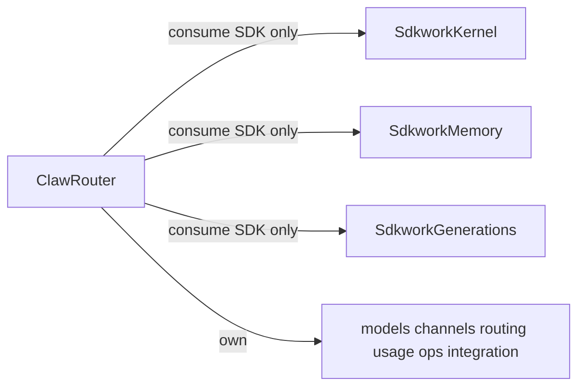

# Claw Router Minimal Domain Migration Design

## Goal

Converge `sdkwork-clawrouter` to a **minimal relay/control-plane** product shell. Non-core domains are **owned only by sibling modules** 鈥?no legacy tables, proxies, adapters, or compatibility layers in Claw Router.

- `sdkwork-kernel`: agent, chat, mcp, skills
- `sdkwork-memory`: memory
- `sdkwork-generations`: generation

**Greenfield assumption:** this is a new system. There is no production legacy data to preserve. Optimize for **one canonical model per domain**, not gradual cutover.

## Non-goals (do not build)

- Dual-write or mirror tables in Claw Router
- Compat adapters, proxy handlers, or feature-flag cutover modes
- One-time backfill / ETL from `ai_memory_*`, `ai_generation_*`, `ai_agent*` / `ai_chat_*`
- Keeping deprecated OpenAPI paths 鈥渇or transition鈥?- Hand-editing generated SDK output

## Scope

In scope per domain batch:

1. Delete extracted-domain schema from Claw Router registry + DDL
2. Delete extracted-domain OpenAPI operations from Claw Router APIs
3. Regenerate Claw Router SDKs (router-core only)
4. Point frontend/backend at sibling SDKs (`@sdkwork/memory-*`, `@sdkwork/generations-*`, `@sdkwork/agent-*`)
5. Remove stale routes, packages, tests, and field contracts in the same batch

Out of scope:

- Owning agent/chat/mcp/skills/memory/generation persistence inside Claw Router

## Ownership model

## Router core retained in Claw Router

- Model and pricing: `ai_model*`, `ai_model_pricing*`, `ai_model_mapping_rule*`
- Channel/provider/routing: `ai_channel*`, `ai_provider*`, `ai_site*`, `ai_routing*`
- Usage/quotas: `ai_usage`, `ai_request_trace`, `ai_quota_policy`, `ai_usage_service_provider_edge`
- Gateway IAM: `iam_gateway_*`
- Integration / service-provider network: `integration_*`
- Operations: `ops_*`
- Commerce **usage projection only**: `commerce_usage_*`, `analytics_service_provider_*`

## Domains to remove from Claw Router (same batch as sibling ownership)

### Memory 鈫?sdkwork-memory only

**Delete from Claw Router:** `ai_memory_space`, `ai_memory_space_binding`, `ai_memory_entry`, `ai_memory_embedding`, `ai_memory_event`, `ai_memory_link`

**Canonical (sibling):** `mem_space`, `mem_event`, `mem_record`, `mem_record_source`, `mem_index`, 鈥?
### Generation 鈫?sdkwork-generations only

**Delete from Claw Router:** `ai_generation_session`, `ai_generation_job`, `ai_generation_asset`, `ai_generation_asset_action`

**Canonical (sibling):** `generation_record`, `generation_dispatch_job`, `generation_result`, `generation_timeline_event`, 鈥?
### Agent / chat / mcp / skills 鈫?sdkwork-kernel only

**Delete from Claw Router:** `ai_agent*`, `ai_chat_*`, `ai_mcp_*`, prompt/skill tables owned by kernel

**Canonical (sibling):** `sdkwork-agent-*` APIs + kernel schema (extend kernel where gaps exist 鈥?chat/skills tables if missing)

**Admin UI note:** `/admin/prompts`, `/admin/mcp`, playground chat are **kernel consumers** until moved to kernel-owned apps; they must call `@sdkwork/agent-*` SDK, not Claw Router backend tables.

## Execution order (delete + wire in one pass per domain)

| Batch | Domain | Claw Router deletes | Claw Router wires |
|-------|--------|---------------------|-------------------|
| **1** | Commerce/platform PC packages | 21 orphan packages (catalog, wallet, 鈥? | 鈥?|
| **2** | Memory | `ai_memory_*` schema, APIs, contracts, tests | `@sdkwork/memory-*` SDK |
| **3** | Generation | `ai_generation_*` schema, APIs, sqlite stores, playground local paths | `@sdkwork/generations-*` SDK |
| **4** | Kernel | `ai_agent*`, `ai_chat*`, `ai_mcp*`, skill/prompt schema in router | `@sdkwork/agent-*` SDK |
| **5** | Router core tighten | IAM/messaging/content stubs in registry if unused | Regenerate router-only OpenAPI/SDK |

Each batch is **done** when: registry + OpenAPI + SDK + frontend/tests contain **zero** references to deleted tables/paths.

## Commercial model guardrails

Implemented in the **owning sibling module**, verified at integration boundaries:

1. Tenant and organization isolation
2. Billing and metering traceability
3. Auditability and lifecycle states
4. Permission boundaries and policy enforcement
5. Retry/idempotency for async jobs and callbacks

Claw Router verifies relay/control-plane concerns: routing, usage facts, quotas, provider edges 鈥?not domain SoR.

## Verification per batch

1. Schema registry / manifest: no deleted table names
2. OpenAPI diff: router contracts router-core only
3. SDK generation: no removed operation symbols
4. `pnpm typecheck` / targeted runtime tests for wired sibling SDKs
5. No `ai_memory_*` / `ai_generation_*` / `ai_agent*` / `ai_chat_*` in router `services/` or `crates/` (except explicit re-exports forbidden)

## Reference docs (field semantics only)

Use when aligning kernel/memory/generations contracts 鈥?**not** for legacy migration:

- `2026-06-21-memory-field-mapping-ai-to-mem.md`
- `2026-06-21-generation-field-mapping-ai-to-generation.md`
- `2026-06-21-kernel-field-mapping-ai-to-agent.md`

## Immediate next batch

**Batch 2 鈥?Memory (greenfield):**

1. Strip `ai_memory_*` from `docs/schema-registry/tables/018-ai.yaml` and registry index
2. Remove memory operations from `apis/app-api` / `apis/backend-api` Claw Router OpenAPI
3. Regenerate `@sdkwork/clawrouter-*` SDKs
4. Point playground (and any memory UI) at `@sdkwork/memory-*` only
5. Delete router memory route crates / Rust stores if present
6. Regenerate schema manifest + frontend contracts

Then **Batch 3 Generation**, then **Batch 4 Kernel** with the same pattern.
